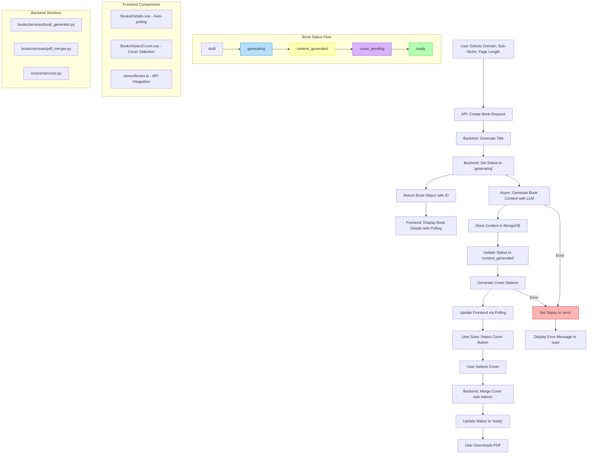
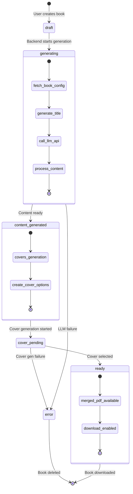
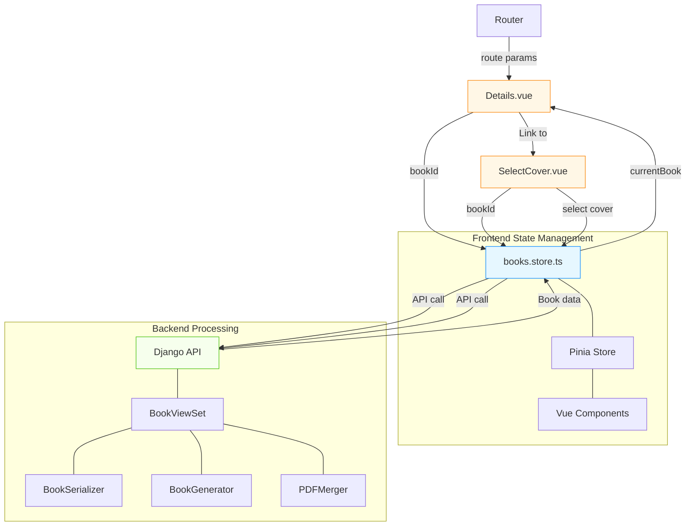
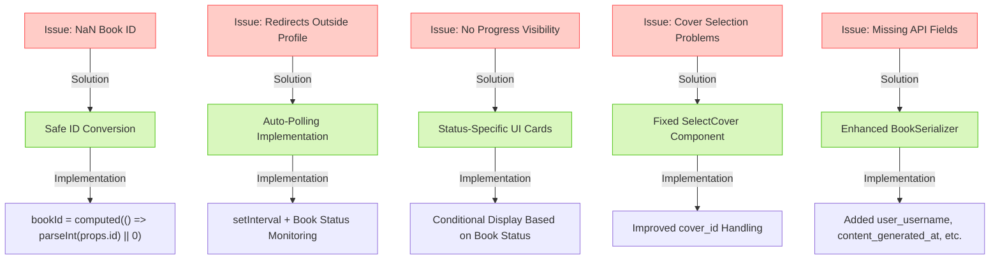

# Book Generation Flow Diagram

```mermaid
flowchart TD
    A[User Selects Domain, Sub-Niche, Page Length] --> B[API: Create Book Request]
    B --> C[Backend: Generate Title]
    C --> D[Backend: Set Status to 'generating']
    D --> E[Return Book Object with ID]
    E --> F[Frontend: Display Book Details with Polling]
    
    %% Async Process
    D --> G[Async: Generate Book Content with LLM]
    G --> H[Store Content in MongoDB]
    H --> I[Update Status to 'content_generated']
    I --> J[Generate Cover Options]
    J --> K[Update Frontend via Polling]
    
    %% Frontend User Flow
    K --> L[User Sees 'Select Cover' Button]
    L --> M[User Selects Cover]
    M --> N[Backend: Merge Cover with Interior]
    N --> O[Update Status to 'ready']
    O --> P[User Downloads PDF]
    
    %% Status Flow
    subgraph "Book Status Flow"
    S1[draft] --> S2[generating]
    S2 --> S3[content_generated]
    S3 --> S4[cover_pending]
    S4 --> S5[ready]
    end
    
    %% Error Handling
    G -- Error --> ERR[Set Status to 'error']
    J -- Error --> ERR
    ERR --> ERR_DISPLAY[Display Error Message to User]
    
    %% Key Components
    subgraph "Frontend Components"
    FC1[Books/Details.vue - Auto-polling]
    FC2[Books/SelectCover.vue - Cover Selection]
    FC3[stores/books.ts - API Integration]
    end
    
    subgraph "Backend Services"
    BS1[books/services/book_generator.py]
    BS2[books/services/pdf_merger.py]
    BS3[covers/services.py]
    end
    
    style S2 fill:#b3e0ff,stroke:#0066cc
    style S3 fill:#ffffb3,stroke:#e6e600
    style S4 fill:#d9b3ff,stroke:#8000ff
    style S5 fill:#b3ffb3,stroke:#00cc00
    style ERR fill:#ffb3b3,stroke:#cc0000
```

## Book Generation State Machine

```mermaid
stateDiagram-v2
    [*] --> draft: User creates book
    draft --> generating: Backend starts generation
    generating --> content_generated: Content ready
    content_generated --> cover_pending: Cover generation started
    cover_pending --> ready: Cover selected
    
    generating --> error: LLM failure
    cover_pending --> error: Cover gen failure
    
    ready --> [*]: Book downloaded
    error --> [*]: Book deleted
    
    state generating {
        [*] --> fetch_book_config
        fetch_book_config --> generate_title
        generate_title --> call_llm_api
        call_llm_api --> process_content
        process_content --> [*]
    }
    
    state content_generated {
        [*] --> covers_generation
        covers_generation --> create_cover_options
        create_cover_options --> [*]
    }
    
    state ready {
        [*] --> merged_pdf_available
        merged_pdf_available --> download_enabled
        download_enabled --> [*]
    }
```

## Book Component Data Flow

```mermaid
flowchart TD
    A[Router] -->|route params| B[Details.vue]
    B -->|bookId| C[books.store.ts]
    C -->|API call| D[Django API]
    D -->|Book data| C
    C -->|currentBook| B
    
    B -->|Link to| E[SelectCover.vue]
    E -->|bookId| C
    E -->|select cover| C
    C -->|API call| D
    
    subgraph "Frontend State Management"
    C --- F[Pinia Store]
    F --- G[Vue Components]
    end
    
    subgraph "Backend Processing"
    D --- H[BookViewSet]
    H --- I[BookSerializer]
    H --- J[BookGenerator]
    H --- K[PDFMerger]
    end
    
    style C fill:#e6f7ff,stroke:#1890ff
    style D fill:#f6ffed,stroke:#52c41a
    style B fill:#fff7e6,stroke:#fa8c16
    style E fill:#fff7e6,stroke:#fa8c16
```

## Fixed Issues Diagram

```mermaid
flowchart TD
    A[Issue: NaN Book ID] -->|Solution| B[Safe ID Conversion]
    B -->|Implementation| C["bookId = computed(() => parseInt(props.id) || 0)"]
    
    D[Issue: Redirects Outside Profile] -->|Solution| E[Auto-Polling Implementation]
    E -->|Implementation| F[setInterval + Book Status Monitoring]
    
    G[Issue: No Progress Visibility] -->|Solution| H[Status-Specific UI Cards]
    H -->|Implementation| I[Conditional Display Based on Book Status]
    
    J[Issue: Cover Selection Problems] -->|Solution| K[Fixed SelectCover Component]
    K -->|Implementation| L[Improved cover_id Handling]
    
    M[Issue: Missing API Fields] -->|Solution| N[Enhanced BookSerializer]
    N -->|Implementation| O[Added user_username, content_generated_at, etc.]
    
    style A fill:#ffccc7,stroke:#ff4d4f
    style D fill:#ffccc7,stroke:#ff4d4f
    style G fill:#ffccc7,stroke:#ff4d4f
    style J fill:#ffccc7,stroke:#ff4d4f
    style M fill:#ffccc7,stroke:#ff4d4f
    
    style B fill:#d9f7be,stroke:#52c41a
    style E fill:#d9f7be,stroke:#52c41a
    style H fill:#d9f7be,stroke:#52c41a
    style K fill:#d9f7be,stroke:#52c41a
    style N fill:#d9f7be,stroke:#52c41a
```