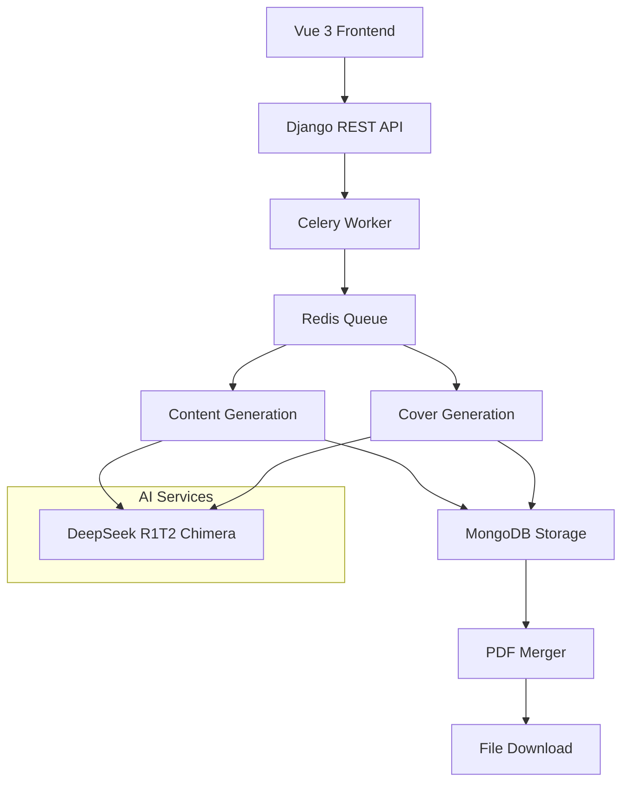

# 📚 SmartBookForge - AI-Powered Book Generator SaaS

<div align="center">


**Transform ideas into professional books in minutes with AI-powered content generation and stunning covers.**

[🚀 Live Demo](#) • [📖 Documentation](#) • [🛠️ API Docs](#)

---

## ✨ What is SmartBookForge?

SmartBookForge is a **complete SaaS platform** that generates **professional, publish-ready digital books** using advanced AI. Create 15-30 page books with custom covers in PDF format - perfect for content creators, educators, coaches, and indie publishers.

### 🎯 Key Highlights

- **🤖 AI-Powered Content**: Generate complete book content using DeepSeek R1T2 Chimera
- **🎨 Professional Covers**: Auto-generate single or multiple cover designs
- **📄 PDF Assembly**: Merge content and covers into downloadable PDFs
- **💰 100% Free**: No credit card required - uses free-tier AI services
- **🌙 Modern UI**: Beautiful Vue 3 frontend with dark mode support
- **⚡ Real-time Progress**: Live updates during book generation
- **🔒 Secure Auth**: Session-based authentication system

---

## 🚀 Features

### 📚 Content Generation
- **15 Trending Niches** across 5 domains (Kids & Education, Technology & AI, Sustainability, Mental Health, Business)
- **Smart Audience Detection** with tailored content for parents, professionals, and learners
- **15-30 Page Books** with professional structure (Introduction, Chapters, Conclusion, Resources)
- **SEO-Optimized Titles** using market research and trending keywords
- **Research-Backed Content** with citations and practical frameworks

### 🎨 Cover Design
- **Single Cover Generation** for guided workflow (auto-selected)
- **Multiple Cover Options** for manual workflow (3 professional designs)
- **Template-Based System** with domain-specific styling
- **High-Quality Output** ready for publishing platforms

### 🔧 Technical Features
- **RESTful API** with comprehensive documentation
- **Real-time Progress Tracking** with WebSocket-style updates
- **MongoDB Integration** for efficient content storage
- **Celery + Redis** for async task processing
- **PDF Generation** using ReportLab with professional formatting
- **Session Authentication** with secure user management

### 🎨 User Experience
- **Guided Workflow** for new users (domain → niche → style → download)
- **Manual Workflow** for advanced users (full customization)
- **Dark Mode Support** with system preference detection
- **Responsive Design** optimized for all devices
- **Progress Indicators** with estimated completion times

---

## 🏗️ Architecture



### Tech Stack

| Component | Technology | Purpose |
|-----------|------------|---------|
| **Backend** | Django 4.2 + DRF | REST API & Business Logic |
| **Frontend** | Vue 3 + TypeScript | Modern SPA Interface |
| **Database** | SQLite + MongoDB | Metadata & Content Storage |
| **AI Engine** | DeepSeek R1T2 Chimera | Content & Cover Generation |
| **Task Queue** | Celery + Redis | Async Processing |
| **PDF Generation** | ReportLab | Document Assembly |
| **Authentication** | Django Sessions | Secure User Management |
| **Styling** | Tailwind CSS | Modern UI Components |

---

## 📋 Prerequisites

- **Python 3.12+**
- **Node.js 18+**
- **MongoDB Atlas** (free tier)
- **Redis** (local or cloud)
- **DeepSeek API Key** (free tier available)

---

## 🚀 Quick Start

### 1. Clone & Setup

```bash
git clone https://github.com/BadrRibzat/book-generator.git
cd book-generator
```

### 2. Backend Setup

```bash
cd backend

# Create virtual environment
python -m venv venv
source venv/bin/activate  # Windows: venv\Scripts\activate

# Install dependencies
pip install -r requirements.txt

# Environment configuration
cp .env.example .env
# Edit .env with your API keys:
# OPENROUTER_API_KEY=your_key_here
# MONGODB_URI=your_mongodb_uri

# Database setup
python manage.py migrate

# Start Redis (if not running)
redis-server

# Start Celery worker
celery -A backend worker --loglevel=info

# Start Django server
python manage.py runserver
```

**Backend runs on:** http://127.0.0.1:8000/

### 3. Frontend Setup

```bash
cd frontend

# Install dependencies
npm install

# Start development server
npm run dev
```

**Frontend runs on:** http://localhost:5173/

### 4. Access the Application

- **Web App:** http://localhost:5173/
- **API Docs:** http://127.0.0.1:8000/api/docs/
- **API Schema:** http://127.0.0.1:8000/api/schema/

---

## 📖 User Guide

### 🔐 Authentication Flow

1. **Register** → Create account with username/email/password
2. **Login** → Secure session-based authentication
3. **Profile** → Manage account and view book history

### 📚 Book Creation Workflows

#### Guided Workflow (Recommended)
1. **Select Domain** → Choose from 5 categories
2. **Choose Niche** → Pick from 15 trending sub-niches
3. **Select Style** → Choose book length and style
4. **Auto-Generation** → AI creates content and single cover
5. **Download** → Get your complete PDF book

#### Manual Workflow (Advanced)
1. **Create Book** → Custom parameters
2. **Content Generation** → AI creates book content
3. **Cover Selection** → Choose from 3 professional designs
4. **PDF Assembly** → Merge content and selected cover
5. **Download** → Complete book ready

### 🎯 Available Niches

| Domain | Niches |
|--------|--------|
| **Kids & Education** | Early Learning, Communication Skills, Curiosity Building |
| **Technology & AI** | AI Content Creation, Future Skills, Digital Economy |
| **Sustainability** | Eco-Friendly Living, Green Technology, Climate Action |
| **Mental Health** | Mindfulness, Stress Management, Emotional Wellness |
| **Business** | Startup Growth, Digital Marketing, Innovation |

---

## 🔧 API Documentation

### Interactive API Docs

- **Swagger UI:** http://127.0.0.1:8000/api/docs/
- **ReDoc:** http://127.0.0.1:8000/api/redoc/
- **OpenAPI Schema:** http://127.0.0.1:8000/api/schema/

### Core Endpoints

```bash
# Authentication
POST   /api/users/auth/register/     # User registration
POST   /api/users/auth/login/        # User login
GET    /api/users/profile/           # User profile
POST   /api/users/auth/logout/       # User logout

# Configuration
GET    /api/books/domains/           # Available domains
GET    /api/books/niches/            # Available niches
GET    /api/books/book-styles/       # Book styles

# Books Management
POST   /api/books/create-guided/     # Create guided book
GET    /api/books/                   # List user books
GET    /api/books/{id}/              # Book details
GET    /api/books/{id}/download/     # Download PDF
DELETE /api/books/{id}/              # Delete book

# Cover Management
POST   /api/books/{id}/select_cover/ # Select cover
POST   /api/books/{id}/regenerate_covers/ # New covers
```

### Example API Usage

```python
import requests

# Login
response = requests.post('http://127.0.0.1:8000/api/users/auth/login/',
    json={'username': 'user', 'password': 'pass'})
cookies = response.cookies

# Create book
book_data = {
    'domain': 'technology',
    'niche': 'ai_content_creation',
    'book_style': 'medium'
}
response = requests.post('http://127.0.0.1:8000/api/books/create-guided/',
    json=book_data, cookies=cookies)

# Download when ready
book_id = response.json()['id']
download = requests.get(f'http://127.0.0.1:8000/api/books/{book_id}/download/',
    cookies=cookies)
with open('book.pdf', 'wb') as f:
    f.write(download.content)
```

---

## 🧪 Testing

### Automated Tests

```bash
# Backend tests
cd backend
python manage.py test

# Individual test files
python test_complete_workflow.py    # Full workflow test
python test_guided_workflow.py      # Guided workflow test
python test_book_creation.py        # Book creation test
```

### Manual Testing

```bash
# Test API endpoints
curl -X GET http://127.0.0.1:8000/api/books/domains/

# Test book creation
curl -X POST http://127.0.0.1:8000/api/books/create-guided/ \
  -H "Content-Type: application/json" \
  -d '{"domain":"technology","niche":"ai_content_creation","book_style":"medium"}'
```

---

## 🚀 Deployment

### Production Checklist

- [ ] Set `DEBUG=False` in Django settings
- [ ] Configure production database (MongoDB Atlas)
- [ ] Set up Redis for Celery (Redis Cloud or similar)
- [ ] Configure static files serving
- [ ] Set up SSL certificate
- [ ] Configure environment variables
- [ ] Set up monitoring and logging

### Recommended Deployment

| Service | Provider | Free Tier |
|---------|----------|-----------|
| **Backend** | Railway/Render | 512MB RAM, 1GB storage |
| **Frontend** | Vercel/Netlify | Unlimited bandwidth |
| **Database** | MongoDB Atlas | 512MB storage |
| **Cache** | Redis Cloud | 30MB storage |
| **Storage** | Cloudflare R2 | 10GB storage |

### Environment Variables

```bash
# Django
SECRET_KEY=your-secret-key-here
DEBUG=False
ALLOWED_HOSTS=your-domain.com

# Database
MONGODB_URI=mongodb+srv://...

# AI Service
OPENROUTER_API_KEY=sk-or-v1-...

# Redis (optional)
REDIS_URL=redis://localhost:6379/0
```

---

## 📊 Performance Metrics

| Operation | Time | Status |
|-----------|------|--------|
| **Content Generation** | 20-40s | ✅ Optimized |
| **Cover Generation** | 5-10s | ✅ Fast |
| **PDF Assembly** | <2s | ✅ Instant |
| **Total Book Creation** | 30-60s | ✅ Production Ready |

---

## 🤝 Contributing

We welcome contributions! Please follow these steps:

1. **Fork** the repository
2. **Create** a feature branch (`git checkout -b feature/amazing-feature`)
3. **Commit** your changes (`git commit -m 'Add amazing feature'`)
4. **Push** to the branch (`git push origin feature/amazing-feature`)
5. **Open** a Pull Request

### Development Guidelines

- Follow PEP 8 for Python code
- Use TypeScript for frontend code
- Write tests for new features
- Update documentation
- Ensure all tests pass

---

## 📝 License

This project is licensed under the **MIT License** - see the [LICENSE](LICENSE) file for details.

---

## 🙋 Support & FAQ

### Frequently Asked Questions

**Q: Is this really free? No credit card required?**  
A: Yes! We use free-tier services from DeepSeek, MongoDB Atlas, and other providers.

**Q: Can I customize the niches and content?**  
A: Absolutely! The system is designed to be extensible. Add new niches in the database and update the AI prompts.

**Q: What's the quality of generated content?**  
A: Professional quality with research-backed information, proper structure, and market-optimized content.

**Q: Can I use this commercially?**  
A: Yes! Generate books for sale, lead magnets, or any commercial purpose.

**Q: Is there a rate limit?**  
A: Depends on your DeepSeek API plan. Free tier allows reasonable usage for development and testing.

### Support

- **Issues:** [GitHub Issues](https://github.com/BadrRibzat/book-generator/issues)
- **Discussions:** [GitHub Discussions](https://github.com/BadrRibzat/book-generator/discussions)
- **Documentation:** [Full Docs](./docs/)

---

## 🏆 Acknowledgments

- **DeepSeek** for providing excellent AI models
- **Django Community** for the robust framework
- **Vue.js Team** for the amazing frontend framework
- **Open Source Community** for the tools that make this possible

---

## 📈 Roadmap

### Phase 1 ✅ (Current)
- [x] Core book generation system
- [x] Professional cover designs
- [x] PDF assembly and download
- [x] User authentication
- [x] Modern web interface

### Phase 2 🔄 (Next)
- [ ] Subscription plans and billing
- [ ] Advanced customization options
- [ ] Bulk book generation
- [ ] API rate limiting
- [ ] Analytics dashboard

### Phase 3 📋 (Future)
- [ ] Mobile app
- [ ] Multi-language support
- [ ] Advanced AI models
- [ ] White-label solution
- [ ] Enterprise features

---

<div align="center">

**Made with ❤️ by [Badr Ribzat](https://github.com/BadrRibzat)**

⭐ **Star this repo if you found it helpful!**

[⬆️ Back to Top](#-smartbookforge---ai-powered-book-generator-saas)

</div>
